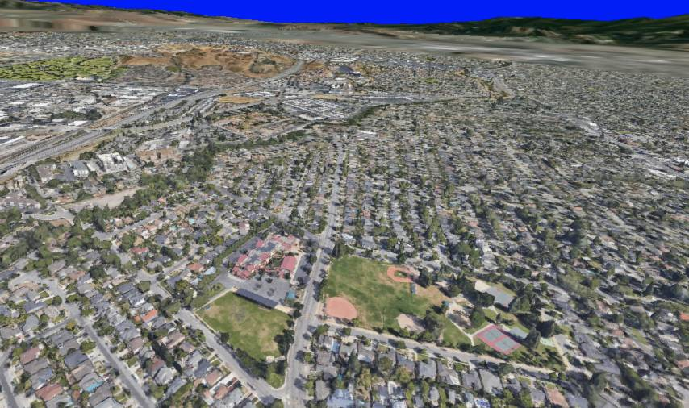

# Earth 3D


Get 3D data from google earth.

[Simple demo](https://aifanatic.github.io/earth-3d/examples/simple/) - [Advanced demo](https://aifanatic.github.io/earth-3d/examples/advanced/)

## Description
This project is a combination of the amazing work from [retroplasma/earth-reverse-engineering](https://github.com/retroplasma/earth-reverse-engineering) and [LexSong/earth-reverse-engineering-utils](https://github.com/LexSong/earth-reverse-engineering-utils) put together to form a usable library.

## Install

### Node
```shell
yarn add https://github.com/AIFanatic/earth-3d
```

### Browser
```html
<script src="https://cdn.jsdelivr.net/gh/AIFAnatic/earth-3d@latest/dist/earth-3d-bundle.js"></script>
```
```javascript
import { NodeManager } from 'https://cdn.jsdelivr.net/gh/AIFAnatic/earth-3d@latest/dist/earth-3d-esm-bundle.js';
```

## Usage
```javascript
import { NodeManager, LatLonBox } from 'earth-3d';

const filterLatLonBox = new LatLonBox(37.304420471191406, 37.3040771484375, -121.88644409179688, -121.88610076904297);

const nodeValidationHandler = (node) => {
    // Filter nodes based on some criteria
    return LatLonBox.is_overlapping(filterLatLonBox, node.latLonBox);
}

const nodeManager = new NodeManager({
    nodeValidationHandler: nodeValidationHandler
});

setInterval(() => {
    const nodes = nodeManager.get_nodes();
}, 100);
```

Notes:
- Since nodes are stored in an octree fashion you cannot just filter the "end" node, all the nodes that belong to the same path at a previous level also need to be included.
- Filtering should be performed with caution, having a big LatLonBox will likely result in a temporary ban from google since it will try and pull all the nodes at all levels.
- The `nodeValidationHandler` method passes a `NodeHeader` which contains the node LatLonBox and OBB, they can be used to filter nodes based on any criteria.
- When using this library the file `ResourcesWorker.js` needs to be copied manually into your distribution directory.
- Nodes need to be filtered and fetched asynchronously, therefore, multiple calls to `getNodes` is expected in order to retrieve all the nodes for a query.

## TODO
- [ ] Documentation

## References
- [retroplasma/earth-reverse-engineering](https://github.com/retroplasma/earth-reverse-engineering)
- [LexSong/earth-reverse-engineering-utils](https://github.com/LexSong/earth-reverse-engineering-utils)

## Disclaimer
This project has no affiliation with Google or any of its affiliates, there may by a chance that you will get a temporary ban from using google maps services due to the high volume of tiles being streamed.